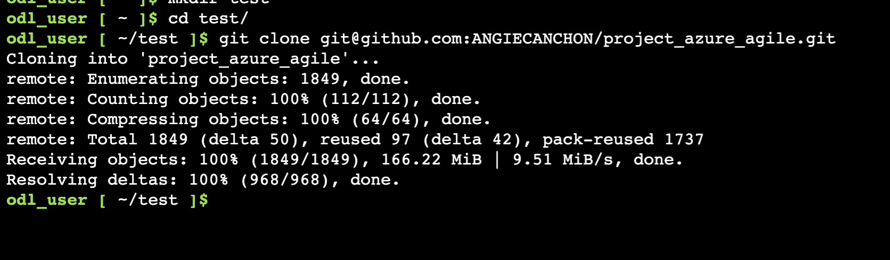

# Overview

<TODO: complete this with an overview of your project>

## Project Plan

* [Spreadsheet Project plan](https://docs.google.com/spreadsheets/d/1LS-WWEUKcpfdR09cVbO_Uh7cINr7j_SfatVX1AcOg2I/edit?usp=sharing)

* [Trello board for the project](https://trello.com/b/pyEgMvHt/udacity-project)

## Instructions

### CI: Set up azure cloud shell

1. Create the following files:
  - A Makefile to build and test the application.
  - A requirements file with the packages needed.
  - A file with some functions.
  - A file to test the functions of the previous file.

* Architectural Diagram 


<TODO:  Instructions for running the Python project.  How could a user with no context run this project without asking you for any help.  Include screenshots with explicit steps to create that work. Be sure to at least include the following screenshots:

* Project running on Azure App Service

pipelane running ok


* Project cloned into Azure Cloud Shell

add ssh:


clone repo



Run Make All


* Passing tests that are displayed after running the `make all` command from the `Makefile`

pass all the git pipelane


* Output of a test run


* Prediction OK postman


* Successful deploy of the project in Azure Pipelines.  [Note the official documentation should be referred to and double checked as you setup CI/CD](https://docs.microsoft.com/en-us/azure/devops/pipelines/ecosystems/python-webapp?view=azure-devops).

* Running Azure App Service from Azure Pipelines automatic deployment

* Successful prediction from deployed flask app in Azure Cloud Shell.  [Use this file as a template for the deployed prediction](https://github.com/udacity/nd082-Azure-Cloud-DevOps-Starter-Code/blob/master/C2-AgileDevelopmentwithAzure/project/starter_files/flask-sklearn/make_predict_azure_app.sh).
The output should look similar to this:

```bash
udacity@Azure:~$ ./make_predict_azure_app.sh
Port: 443
{"prediction":[20.35373177134412]}
```

* Output of streamed log files from deployed application

> 

## Enhancements

<TODO: To improve the project I can update dependecies and add new predictions to get new data, and for the deployment I can use terraform to automated.>

## Demo 

The next URL is on canva and It will be reproduce the configuration to deploy the web app in azure


